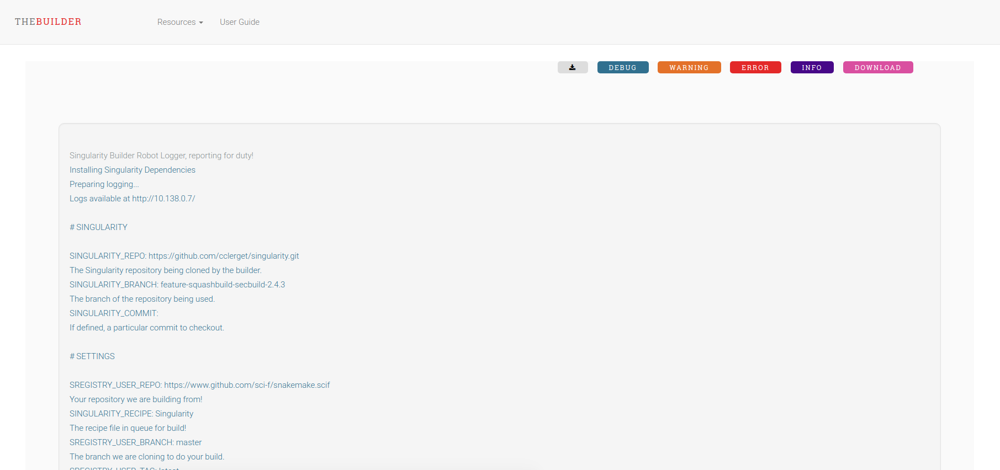
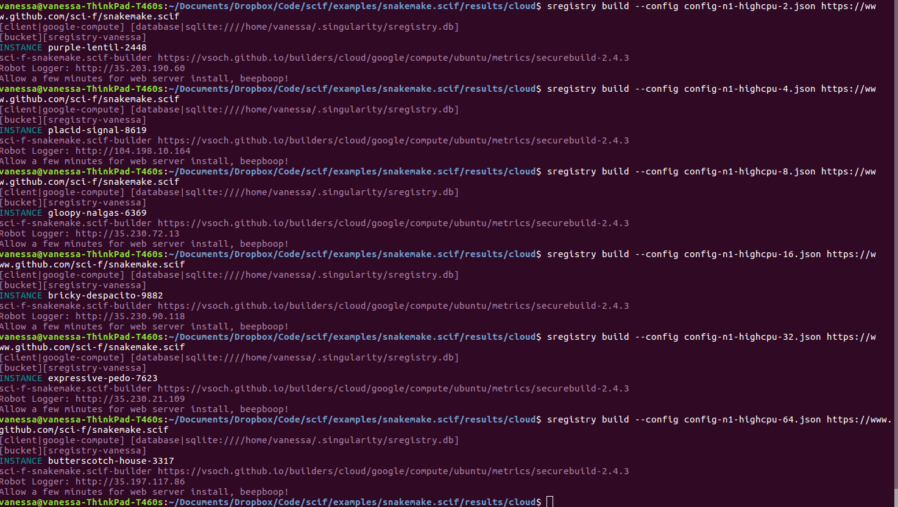

# Container Races!

Here we want to run the analysis on a cloud instance, meaning building the container
and then running the analysis (with massif) and retrieving the result files
to see if the instance size makes any difference. I'm not sure.

## Setup

Make sure sregistry is installed
```
pip install sregistry==0.0.76
```

We aren't going to use the default builder repo, we are going to use @vsoch.
```
export SREGISTRY_GOOGLE_PROJECT="vanessasaurus"
export GOOGLE_APPLICATION_CREDENTIALS='/path/to/credentials.json'
export SREGISTRY_CLIENT=google-compute
export SREGISTRY_BUILDER_REPO=https://vsoch.github.io/builders
```

Now look at templates available, there should be minimally two!

```
$ sregistry build templates
1  /cloud/google/compute/ubuntu/securebuild-2.4.3.json
2  /cloud/google/compute/ubuntu/metrics/securebuild-2.4.3.json
```

Note that the metrics recipe is currently intended to run a container 
built with valgrind installed as an application. For this reason it's not
integrated into the main set of builders, it's sort of still testing
this idea. Then you should be able to save one! We will save multiple versions of this,
tweak the variables, and then run.

```
$ sregistry build templates cloud/google/compute/ubuntu/metrics/securebuild-2.4.3.json > config-n1-standard-1.json
```

The base is a `n1-standard-1` instance type:

```
 grep -R n1-standard-1 config-base.json 
            "SREGISTRY_BUILDER_machine_type": "n1-standard-1",
```

At this point I looked at the [different machine types](https://cloud.google.com/compute/docs/machine-types)
(and also be careful of [pricing](https://cloud.google.com/compute/pricing#machinetype)) 
and chose a set to build:

```
# Standard Instances
sed 's/n1-standard-1/n1-standard-2/g' config-n1-standard-1.json > config-n1-standard-2.json
sed 's/n1-standard-1/n1-standard-4/g' config-n1-standard-1.json > config-n1-standard-4.json
sed 's/n1-standard-1/n1-standard-8/g' config-n1-standard-1.json > config-n1-standard-8.json
sed 's/n1-standard-1/n1-standard-16/g' config-n1-standard-1.json > config-n1-standard-16.json
sed 's/n1-standard-1/n1-standard-32/g' config-n1-standard-1.json > config-n1-standard-32.json
sed 's/n1-standard-1/n1-standard-64/g' config-n1-standard-1.json > config-n1-standard-64.json

# High Memory
sed 's/n1-standard-1/n1-highmem-2/g' config-n1-standard-1.json > config-n1-highmem-2.json
sed 's/n1-standard-1/n1-highmem-4/g' config-n1-standard-1.json > config-n1-highmem-4.json
sed 's/n1-standard-1/n1-highmem-8/g' config-n1-standard-1.json > config-n1-highmem-8.json
sed 's/n1-standard-1/n1-highmem-16/g' config-n1-standard-1.json > config-n1-highmem-16.json
sed 's/n1-standard-1/n1-highmem-32/g' config-n1-standard-1.json > config-n1-highmem-32.json
sed 's/n1-standard-1/n1-highmem-64/g' config-n1-standard-1.json > config-n1-highmem-64.json

# High CPU
sed 's/n1-standard-1/n1-highcpu-2/g' config-n1-standard-1.json > config-n1-highcpu-2.json
sed 's/n1-standard-1/n1-highcpu-4/g' config-n1-standard-1.json > config-n1-highcpu-4.json
sed 's/n1-standard-1/n1-highcpu-8/g' config-n1-standard-1.json > config-n1-highcpu-8.json
sed 's/n1-standard-1/n1-highcpu-16/g' config-n1-standard-1.json > config-n1-highcpu-16.json
sed 's/n1-standard-1/n1-highcpu-32/g' config-n1-standard-1.json > config-n1-highcpu-32.json
sed 's/n1-standard-1/n1-highcpu-64/g' config-n1-standard-1.json > config-n1-highcpu-64.json
```

And then launch each! Each will give you a url to go to, and then you can watch the builder go!

```
sregistry build --config config-n1-standard-4.json https://www.github.com/sci-f/snakemake.scif
[client|google-compute] [database|sqlite:////home/vanessa/.singularity/sregistry.db]
[bucket][sregistry-vanessa]
INSTANCE bumfuzzled-banana-0797
sci-f-snakemake.scif-builder https://vsoch.github.io/builders/cloud/google/compute/ubuntu/metrics/securebuild-2.4.3
Robot Logger: http://35.230.72.13
Allow a few minutes for web server install, beepboop!
```



The full set of launches were the following:

```
sregistry build --config config-n1-standard-1.json https://www.github.com/sci-f/snakemake.scif
sregistry build --config config-n1-standard-2.json https://www.github.com/sci-f/snakemake.scif
sregistry build --config config-n1-standard-4.json https://www.github.com/sci-f/snakemake.scif
sregistry build --config config-n1-standard-8.json https://www.github.com/sci-f/snakemake.scif
sregistry build --config config-n1-standard-16.json https://www.github.com/sci-f/snakemake.scif
sregistry build --config config-n1-standard-32.json https://www.github.com/sci-f/snakemake.scif
sregistry build --config config-n1-highmem-2.json https://www.github.com/sci-f/snakemake.scif
sregistry build --config config-n1-highmem-4.json https://www.github.com/sci-f/snakemake.scif
sregistry build --config config-n1-highmem-8.json https://www.github.com/sci-f/snakemake.scif
sregistry build --config config-n1-highmem-16.json https://www.github.com/sci-f/snakemake.scif
sregistry build --config config-n1-highmem-32.json https://www.github.com/sci-f/snakemake.scif
sregistry build --config config-n1-highmem-64.json https://www.github.com/sci-f/snakemake.scif
sregistry build --config config-n1-highcpu-2.json https://www.github.com/sci-f/snakemake.scif
sregistry build --config config-n1-highcpu-4.json https://www.github.com/sci-f/snakemake.scif
sregistry build --config config-n1-highcpu-8.json https://www.github.com/sci-f/snakemake.scif
sregistry build --config config-n1-highcpu-16.json https://www.github.com/sci-f/snakemake.scif
sregistry build --config config-n1-highcpu-32.json https://www.github.com/sci-f/snakemake.scif
sregistry build --config config-n1-highcpu-64.json https://www.github.com/sci-f/snakemake.scif
```

The instance names are amazing.



And this could definitely be run more elegantly from a script, but I figured I'd bash it out :)
We could have put the variables in a loop, but I took
the approach of one config file per launch so that I could have them hard coded.

I then downloaded the .tar.gz files in the Storage Console (because it was easy enough)
and was able to compare the valgrind plots with the viewer.

## Next Steps
What do I want to do? I want to make a template that a general user can use, intended for
the Singularityhub builder! Specifically:

 - the user should put a test that produces some output to run in the `%test` section.
 - the container will be built from the same secure build
 - output data should be put in a `data` folder in the root of the repository with the Singularity recipe.

Then we can have a launcher of sorts that will launch the build across some number of platforms, starting with variables like the machine varied, and then having variables related to the analysis varied.
